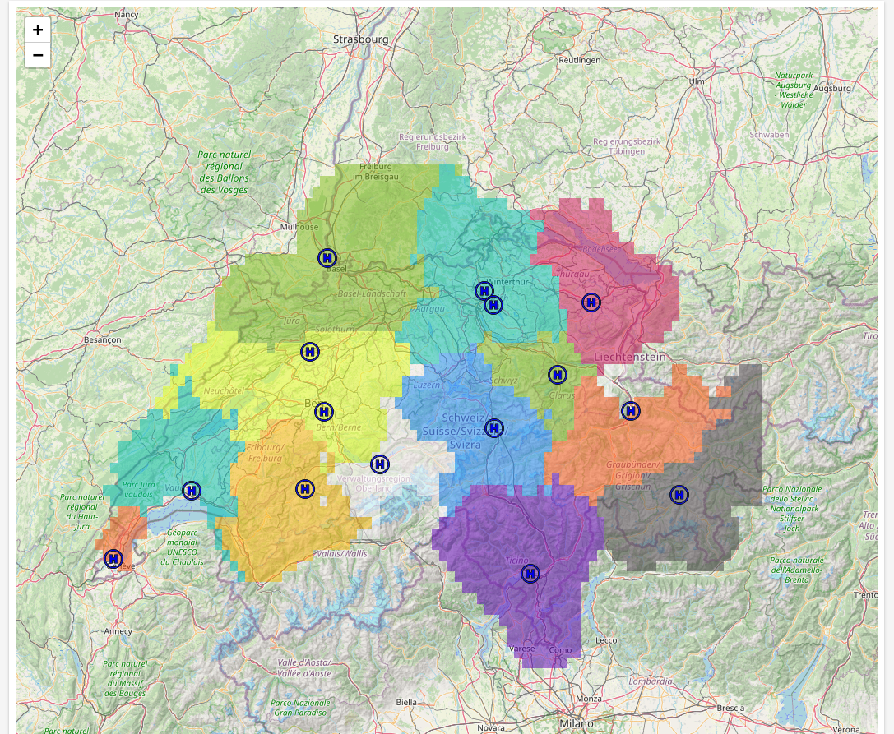
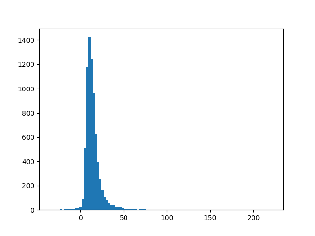
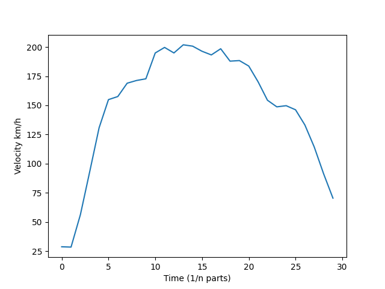
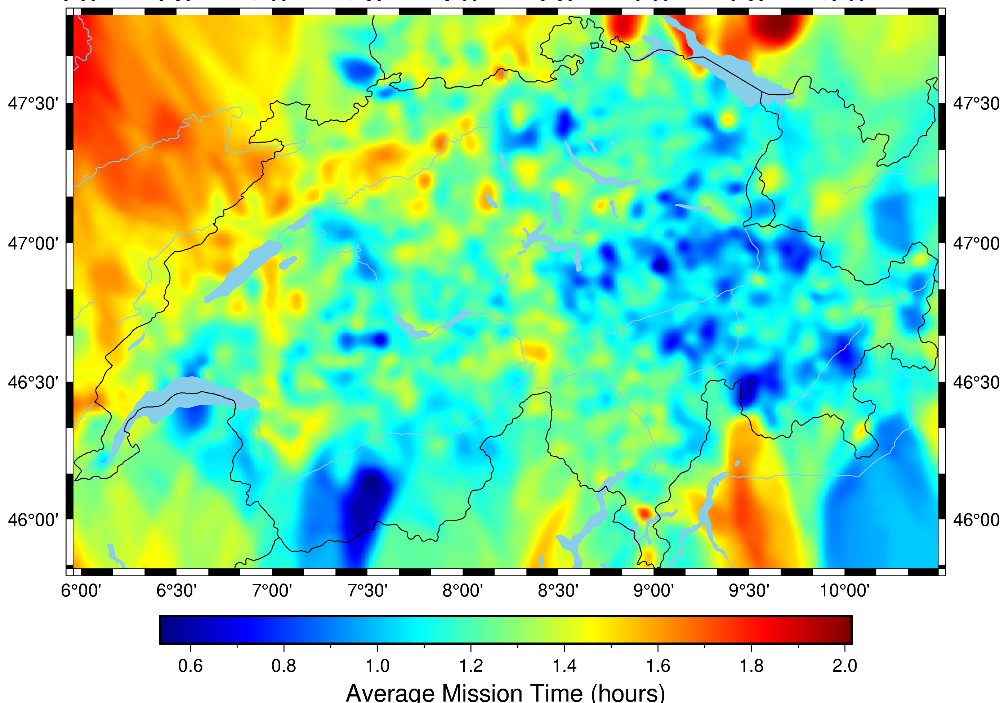
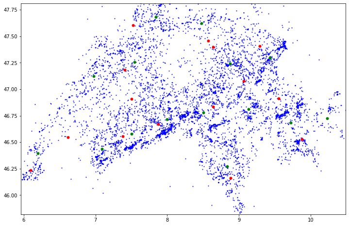
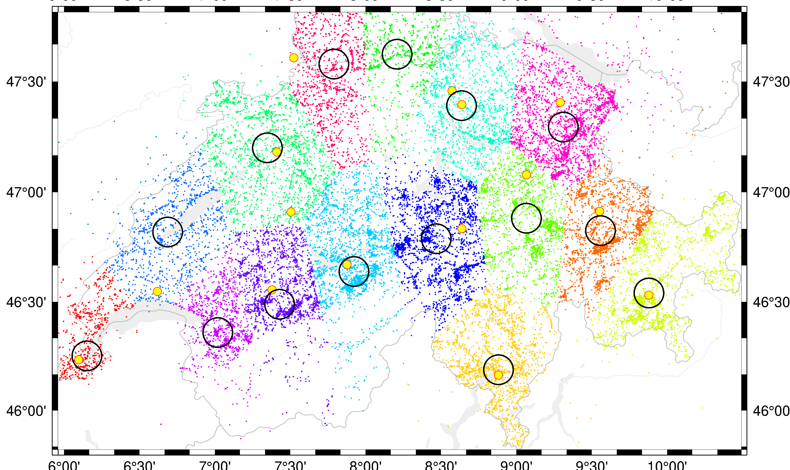

# rega-ds

## Data 



### T1 distribution



## Average speed of a helicopter



## K-nearest neighbour


`k=32`

## Clustering

### k-means



```
k = 25
existing bases = red
cluster centers = green
```
### k-medians

minimise the total Euclidean distance to the cluster centers.
In the map below, each mission point is coloured according to which cluster they belong to. Black circles indicate rough locations of cluster centres (i.e. the point that has lowest average distance to all mission locations belonging to this cluster), which can be perceived as suggested base locations. Large yellow points are locations of the existing bases.



# weather data

There are different possible sources of the weather data:

- https://meteotest.ch/en/weather-api/climate-data - may be an overkill, but there is the historical climate data for 8000 weather stations
- https://opendata.swiss/en/dataset/klimamessnetz-tageswerte - data series of daily values since start of measurements
- https://registry.opendata.aws/noaa-ghcn/ - AWS open registry. [Example of how to use the data](https://aws.amazon.com/blogs/industries/calculating-growing-degree-days-using-aws-registry-of-open-data/)
- https://opendata.swiss/en/dataset?q=weather - current measurements
- https://hack.opendata.ch/project/201 - current measurements
- http://www.agrometeo.ch/de/meteorology/datas - unchecked


